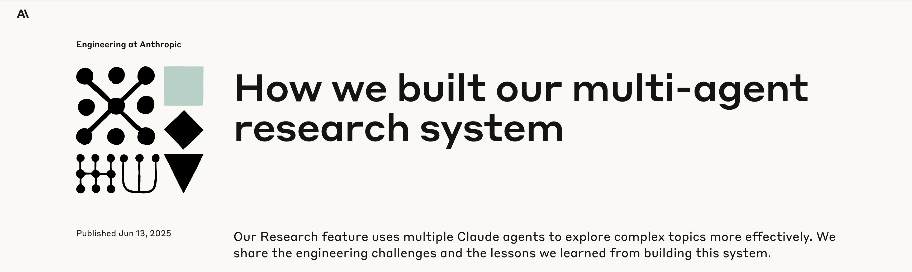

# Multi-Agent Research System POC

A proof-of-concept implementation of a multi-agent research system inspired by [Anthropic's research architecture](https://www.anthropic.com/engineering/built-multi-agent-research-system). This system uses coordinated AI agents to conduct comprehensive research on complex queries through query decomposition, parallel research execution, and intelligent synthesis.



*Inspired by Anthropic's approach to building multi-agent research systems*

## 🏗️ System Architecture

### Core Components

```
┌─────────────────────────────────────────────────────────────┐
│                    RESEARCH ORCHESTRATOR                    │
├─────────────────────────────────────────────────────────────┤
│  • Query Decomposition    • Agent Coordination             │
│  • Task Distribution      • Result Synthesis               │
└─────────────────────┬───────────────────────────────────────┘
                      │
        ┌─────────────┼─────────────┐
        │             │             │
┌───────▼──────┐ ┌────▼────┐ ┌──────▼─────┐
│ Research     │ │ Research│ │ Research   │
│ Agent 1      │ │ Agent 2 │ │ Agent N    │
├──────────────┤ ├─────────┤ ├────────────┤
│ Subtask A    │ │Subtask B│ │ Subtask C  │
│ Analysis     │ │Analysis │ │ Analysis   │
└──────────────┘ └─────────┘ └────────────┘
        │             │             │
        └─────────────┼─────────────┘
                      │
┌─────────────────────▼─────────────────────┐
│            SYNTHESIS ENGINE               │
├───────────────────────────────────────────┤
│  • Combines findings from all agents      │
│  • Creates comprehensive final report     │
│  • Adds citations and source attribution │
└───────────────────────────────────────────┘
```

### Research Flow

1. **Query Input** → User provides research question
2. **Decomposition** → System breaks query into 3-4 focused subtasks
3. **Parallel Research** → Multiple agents research different aspects simultaneously
4. **Synthesis** → Combines all findings into comprehensive report
5. **Output** → Structured report with executive summary, findings, and analysis

### Implementation Architecture

```
deep-research-demo/
├── 🎯 Entry Points
│   ├── research.py             # Fast, reliable research (recommended)
│   ├── research_mock.py        # Mock research (no API key needed)
│   └── research_full.py        # Full async version
│
├── 🧠 Core Research System
│   └── src/
│       ├── research_system_simple.py    # Main working implementation
│       ├── research_system.py           # Full multi-agent architecture
│       │
│       ├── 🤖 Agents/
│       │   ├── base_agent.py           # Abstract agent interface
│       │   ├── orchestrator.py         # Lead coordination agent
│       │   ├── research_agent.py       # Specialized research agents
│       │   ├── web_search_agent.py     # Web search capabilities
│       │   └── citation_agent.py       # Source attribution
│       │
│       └── 🔗 Coordination/
│           ├── memory_manager.py       # Context management
│           └── task_coordinator.py     # Task execution
│
├── ⚙️ Configuration
│   ├── requirements.txt        # Python dependencies
│   ├── .env                   # API configuration
│   └── setup.sh              # Setup script
│
└── 📚 Documentation
    └── README.md              # This file
```

## 🚀 Quick Start

### Prerequisites

- Python 3.8+
- Anthropic API key (get from [console.anthropic.com](https://console.anthropic.com))

### 1. Environment Setup

```bash
# Clone or navigate to project directory
cd deep-research-demo

# Create and activate virtual environment
python3 -m venv venv
source venv/bin/activate  # On Windows: venv\Scripts\activate

# Install dependencies
pip install -r requirements.txt
```

### 2. API Configuration

Create your `.env` file:

```bash
# Option 1: Copy from example
cp .env.example .env

# Option 2: Create directly
echo "ANTHROPIC_API_KEY=your_actual_api_key_here" > .env
echo "MODEL_NAME=claude-3-5-sonnet-20241022" >> .env
```

Edit `.env` and replace `your_actual_api_key_here` with your real Anthropic API key.

### 3. Run the System

**🔥 Recommended (Fast & Reliable):**
```bash
# Research with preset queries
python research.py

# Interactive mode
python research.py --interactive
```

**🧪 Testing Without API Key:**
```bash
# Mock research with simulated responses
python research_mock.py

# Interactive mock mode
python research_mock.py --interactive
```

**⚡ Full Multi-Agent System:**
```bash
# Complete architecture (slower but more features)
python research_full.py

# Interactive full system
python research_full.py --interactive
```

## 💡 Usage Examples

### Basic Research Query

```python
from src.research_system_simple import SimpleResearchSystem

# Initialize the system
research_system = SimpleResearchSystem()

# Conduct research
results = research_system.conduct_research(
    query="What are the latest developments in quantum computing?"
)

# Access results
print(f"Query: {results['query']}")
print(f"Subtasks: {results['total_subtasks']}")
print(f"Report: {results['final_report']}")
```

### Interactive Research Session

```bash
$ python research.py --interactive

🎯 Interactive Research Demo
Enter your research queries (type 'quit' to exit)

🔍 Research query: How does renewable energy impact the economy?
🔄 Researching...

📋 Results:
# Economic Impact of Renewable Energy: Comprehensive Analysis

## Executive Summary
Renewable energy has demonstrated significant positive economic impacts...
[detailed report continues]

🔍 Research query: quit
```

## 🎯 Key Features

### ✅ **Query Decomposition**
- Automatically breaks complex queries into 3-4 focused subtasks
- Each subtask targets a specific aspect of the research question
- Ensures comprehensive coverage of the topic

### ✅ **Parallel Research Execution**
- Multiple specialized agents work simultaneously
- Each agent conducts deep research on assigned subtasks
- Significantly faster than sequential research

### ✅ **Intelligent Synthesis**
- Combines findings from all research agents
- Creates structured, comprehensive reports
- Maintains logical flow and coherent analysis

### ✅ **Multiple Operation Modes**
- **Simple Mode**: Fast, reliable research (recommended)
- **Mock Mode**: Testing without API costs
- **Full Mode**: Complete multi-agent architecture

### ✅ **Interactive & Batch Processing**
- Command-line interactive research sessions
- Batch processing of multiple queries
- Structured output formats

## 📊 Performance Characteristics

| Mode | Speed | API Calls | Features | Use Case |
|------|-------|-----------|----------|----------|
| Simple | ⚡ Fast | 4-6 per query | Core research | Production |
| Mock | 🚀 Instant | 0 | Full simulation | Testing |
| Full | ⏱️ Moderate | 8-12 per query | All features | Development |

## 🔧 Configuration Options

### Environment Variables

```bash
# Required
ANTHROPIC_API_KEY=sk-ant-api03-...    # Your Anthropic API key

# Optional
MODEL_NAME=claude-3-5-sonnet-20241022  # Claude model to use
```

### Research Parameters

```python
# Customize research behavior
results = research_system.conduct_research(
    query="Your research question",
    # Add custom parameters as system evolves
)
```

## 📈 Example Research Output

### Input Query
```
"What are the environmental benefits of electric vehicles?"
```

### System Processing
```
🔍 Query: What are the environmental benefits of electric vehicles?

1️⃣ Decomposing query...
✅ Found 4 subtasks:
  1. Analyze direct emissions reduction from electric vehicles
  2. Examine lifecycle environmental impact including battery production
  3. Evaluate grid impact and renewable energy integration
  4. Compare environmental footprint with conventional vehicles

2️⃣ Researching 4 subtasks...
  ✅ Subtask 1 completed
  ✅ Subtask 2 completed  
  ✅ Subtask 3 completed
  ✅ Subtask 4 completed

3️⃣ Synthesizing results...
✅ Synthesis completed
```

### Output Report
```
# Environmental Benefits of Electric Vehicles: Comprehensive Analysis

## Executive Summary
Electric vehicles (EVs) provide substantial environmental benefits compared to 
conventional internal combustion engine vehicles, with lifecycle emissions 
reductions of 60-70% in regions with clean electricity grids...

## Key Findings
- **Direct Emissions**: Zero tailpipe emissions reduce urban air pollution
- **Lifecycle Impact**: 60-70% reduction in total emissions with clean grids
- **Grid Integration**: Enables better renewable energy utilization
- **Future Potential**: Benefits increase as grid becomes cleaner

## Detailed Analysis
[Comprehensive analysis of each research area...]

## Conclusions
[Synthesis of findings with implications and recommendations...]
```

## 🛠️ Development

### Adding New Research Capabilities

```python
# Extend the SimpleResearchSystem class
class CustomResearchSystem(SimpleResearchSystem):
    def conduct_specialized_research(self, query, domain="general"):
        # Add domain-specific research logic
        pass
```

### Testing

```bash
# Run mock tests (no API required)
python research_mock.py

# Test specific components
python -c "from src.research_system_simple import SimpleResearchSystem; print('✅ Import successful')"
```

## 🔒 Security & Best Practices

- ✅ API keys loaded from environment variables
- ✅ No secrets logged or stored in memory
- ✅ HTTPS for all external API calls
- ✅ Input validation and error handling

## 🐛 Troubleshooting

### Common Issues

**API Key Error:**
```bash
❌ Configuration error: Anthropic API key is required
```
**Solution:** Check your `.env` file has the correct `ANTHROPIC_API_KEY`

**Import Errors:**
```bash
❌ ModuleNotFoundError: No module named 'anthropic'
```
**Solution:** Activate virtual environment and install requirements:
```bash
source venv/bin/activate
pip install -r requirements.txt
```

**Timeout Issues:**
```bash
❌ Command timed out
```
**Solution:** Use the simple research for faster results:
```bash
python research.py
```

### Getting Help

- 📖 Review this README for usage patterns
- 🧪 Try mock mode first: `python research_mock.py`
- 🔍 Check your API key in `.env` file
- 📝 Start with simple queries to test functionality

## 🎓 Educational Use

This project demonstrates key concepts from Anthropic's multi-agent research:

- **Orchestrator-Worker Pattern**: Central coordination with specialized agents
- **Query Decomposition**: Breaking complex problems into manageable parts
- **Parallel Processing**: Simultaneous execution for efficiency
- **Synthesis**: Combining multiple perspectives into coherent output

Perfect for learning about:
- Multi-agent AI systems
- Research automation
- LLM orchestration
- Async programming patterns

## 📄 License

This project is for educational and research purposes. Built as a proof-of-concept implementation of multi-agent research systems.

---

**Ready to start researching?** 🚀

```bash
source venv/bin/activate
python research.py --interactive
```